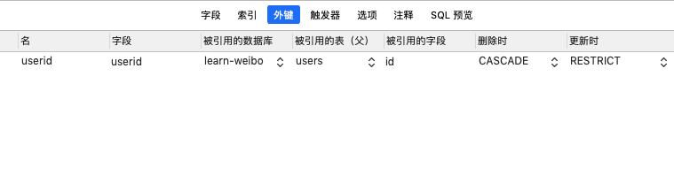

- 下载 安装 建库

- 修改密码 SET PASSWORD FOR 'root'@'localhost' = PASSWORD('newpass');
  mysql -u root

- 建表基本的 sql 语句

- 基本操作

  > 增删改查
  > 查询总数：select count(id) as\`count\` form blogs;
  > 分页：select \* from blogs order by id desc limit 10; // 第一页
  > 分页：select \* from blogs order by id desc limit 10 offset page\*10; // 第一页

* 外键 和 连表查询
  > 创建外键

> 更新限制 删除级联
> 连表查询 :
> 多对一查询的时候：
> select \* from blogs inner join users on users.id = blogs.userid
> select blogs.\*,users.username,users.nickname from blogs inner join users on users.id = blogs.userid
> 一对多查询的时候：
> select \* from users outer join blogs on users.id = blogs.userid
> select users.\*,blogs.title,blogs.content from users outer join blogs on users.id = blogs.userid
