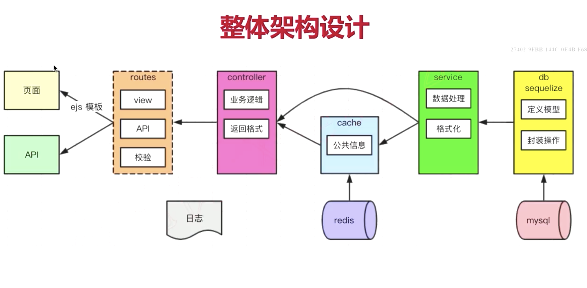
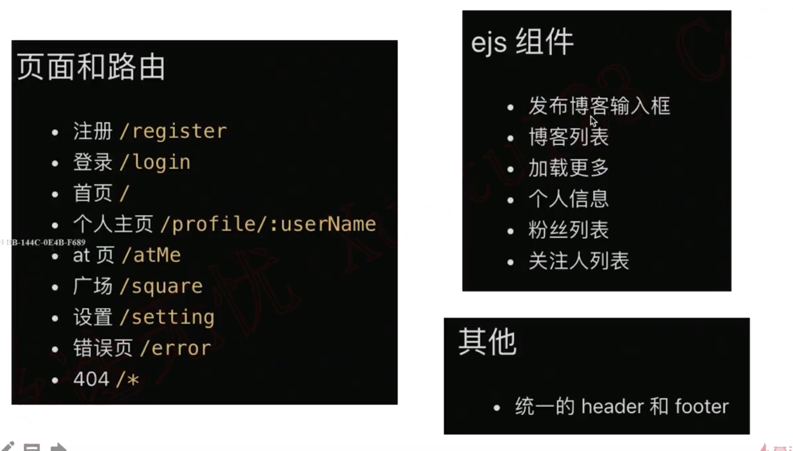
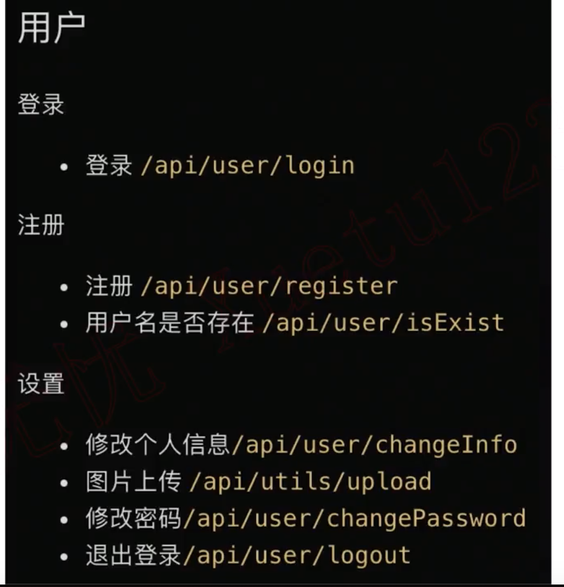
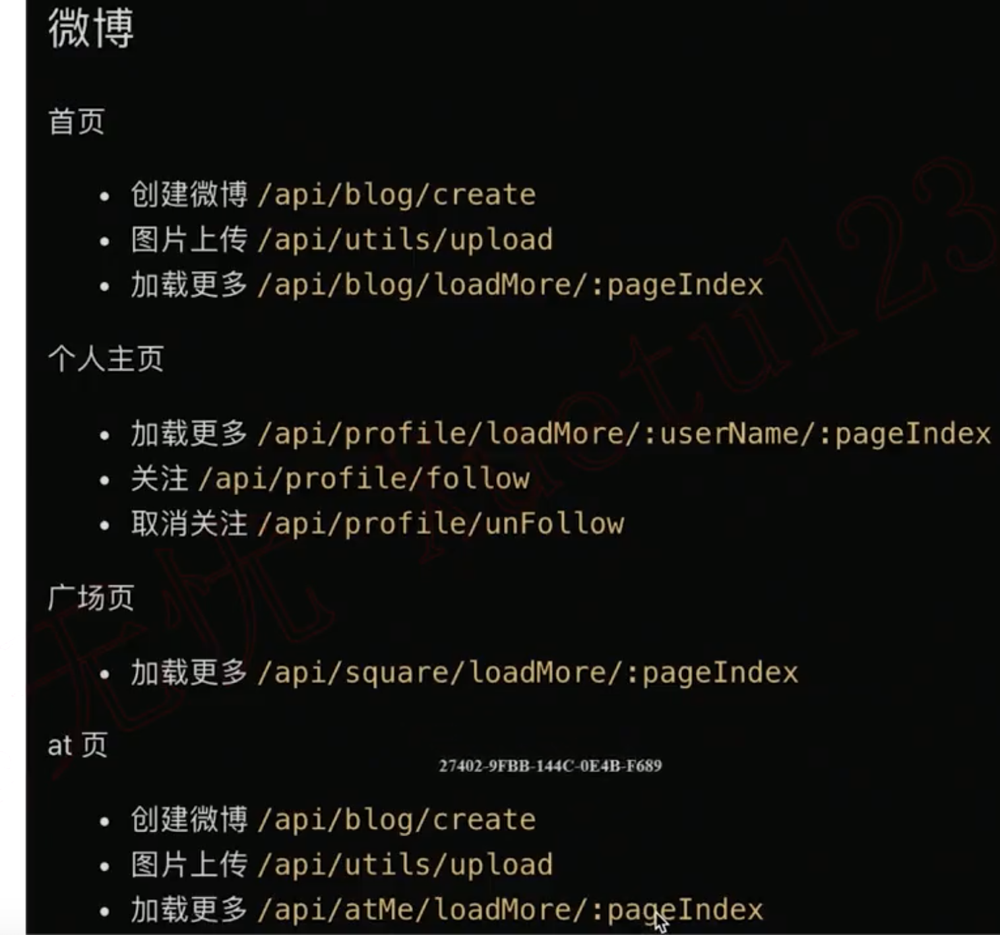

- 架构设计
  

- 页面（模板，路由）和 API 设计
  
  
  

* 数据模型设计
  > 关系型数据库 三大范式：
  > 属性的原子性：每一列都不能再拆解
  > 记录的唯一性：有唯一的组件，其他属性都依赖于这个主键
  > 字段的冗余性：不存在数据冗余和传递依赖

> 以上使得 数据规范严谨，不易出错
> 占用空间更小
> 访问速度更快


- @ 功能如何实现

- 图片上传如何实现

- 目录结构

```
src
├── conf // 配置文件
├── controller // 业务处理
├── database // 数据库设置
├── model // 模型
├── public // 静态文件
├── routes // 页面与api路由
├── service // 数据处理
├── utils // 工具
└── views // 前端页面
```

- 功能
  > 用户管理 （登陆 注册）
  > 用户设置 （修改基本信息，修改密码，退出登陆）
  > 创建微博 （显示个人微博列表和个人信息，暂不做关注功能）
  > 广场页 （使用缓存）
  > 关注和取消关注 显示粉丝关注人
  > 首页
  > @ 和 回复

* 用户管理：
  > 页面：模板和路由
  > 数据建模
  > 开发注册功能
  > 开发登陆功能
  > 抽离 loginCheck 中间件
  > 单元测试
