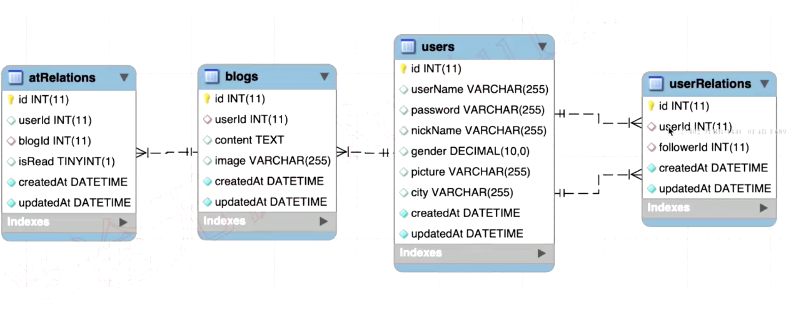

- 架构设计
  

- 页面（模板，路由）和 API 设计
  
  
  

* 数据模型设计
  > 关系型数据库 三大范式：
  > 属性的原子性：每一列都不能再拆解
  > 记录的唯一性：有唯一的组件，其他属性都依赖于这个主键
  > 字段的冗余性：不存在数据冗余和传递依赖

> 以上使得 数据规范严谨，不易出错
> 占用空间更小
> 访问速度更快

- @ 功能如何实现

- 图片上传如何实现
